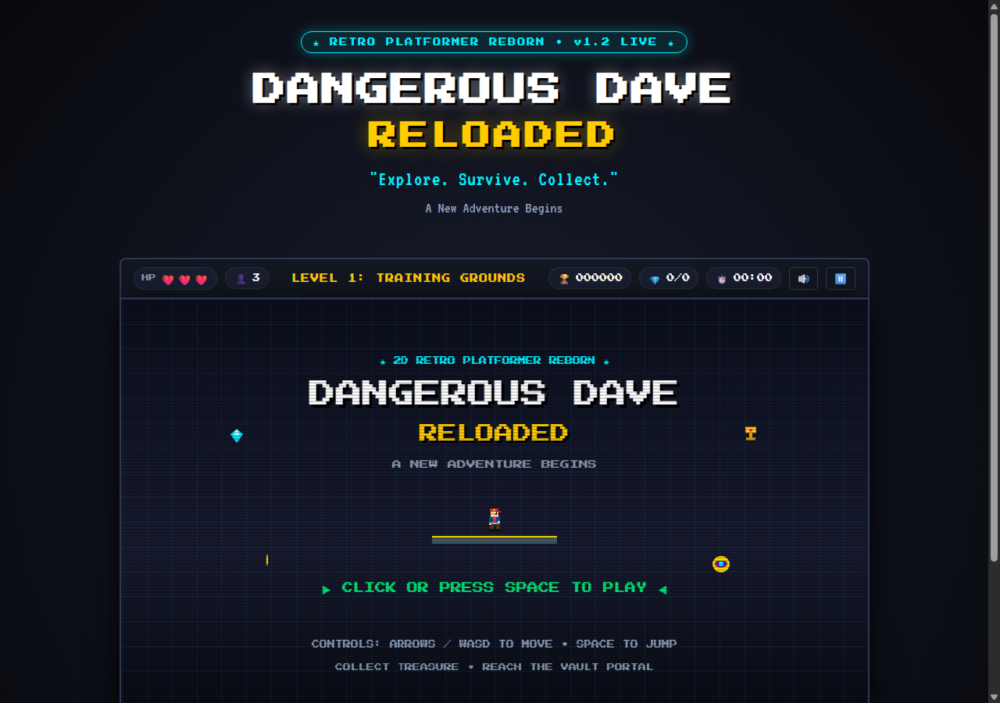

# 🕹️ DANGEROUS DAVE: RELOADED

> **"Explore. Survive. Collect."**  
> *A New Adventure Begins*

[](https://nidhishri2005.github.io/dangerous-dave-reloaded/)
[](https://nidhishri2005.github.io/dangerous-dave-reloaded/)

### 🎮 [👉 CLICK HERE TO PLAY THE GAME IN YOUR BROWSER 👈](https://nidhishri2005.github.io/dangerous-dave-reloaded/)



---

A modern, responsive, and fair 2D browser platformer built from scratch with pure HTML5 Canvas and Web Audio API synthesis. Inspired by the spirit of classic retro adventure platformers, engineered without their frustrating pitfalls.

---

## 🌟 Features

* **Zero External Dependencies**: 100% programmatic pixel-art rendering and procedural Web Audio chiptune synthesis. Instant loading, zero 404 image/audio errors.
* **Responsive Modern Movement**:
  * **Coyote Time**: 120ms forgiving window to jump even after stepping off a platform edge.
  * **Jump Buffering**: 140ms pre-landing jump queue for seamless chain jumps.
  * **Variable Jump Height**: Tap for a low hop, hold for maximum height.
  * **Snappy Kinematics**: High ground friction and responsive aerial maneuverability.
* **5 Diverse Hand-Crafted Levels**:
  1. **Level 1 — Training Grounds**: Gentle tutorial signposts, coin paths, basic walker enemy, safe exit gate.
  2. **Level 2 — Crystal Caverns**: Moving platforms, vertical stalagmites, crystal spikes, cyber bats.
  3. **Level 3 — Forgotten Ruins**: Crumbling temple slabs, crumbling bridges, risk/reward branching paths.
  4. **Level 4 — Shadow Factory**: High-speed machinery, timed laser grids, charging Rammer bots.
  5. **Level 5 — The Lost Vault**: The ultimate platforming gauntlet, leading to an epic multi-phase Guardian boss encounter!
* **Readable Enemies with Visual Telegraphs**:
  * **Walker (Patrol Mech)**: Reliable back-and-forth movement, can be stomped from above.
  * **Flyer (Cyber Drone)**: Predictable harmonic sine-wave flight path.
  * **Charger (Rammer Bot)**: Detects line of sight, flashes a prominent warning **`!`** telegraph, then charges and stuns itself on walls.
  * **Ancient Vault Guardian (Boss)**: Multi-phase encounter with ground slams, horizontal dashes, and exposed core vulnerability windows.
* **Rewarding Collectibles & Secrets**:
  * **Coin**: +10 pts
  * **Gem**: +50 pts
  * **Treasure Chalice**: +100 pts
  * **Secret Relic**: +250 pts (Hidden chamber in every level!)
* **Temporary Power-Ups**:
  * 🛡️ **Shield**: Absorbs 1 incoming hit.
  * ⚡ **Speed Boost**: 50% movement speed increase with ghost trail effects.
  * 🪽 **Double Jump**: Mid-air jump with particle burst.
  * 🧲 **Treasure Magnet**: Pulls all nearby coins and gems directly toward Dave.
* **Checkpoints & Rapid Respawn**:
  * Checkpoints activate with audio-visual chimes and light beams.
  * Quick 650ms respawn displaying specific death cause (*"SPIKES GOT YOU!"*, *"VAPORIZED BY LASER!"*).
* **Save System (`localStorage`)**:
  * Tracks unlocked levels, completion badges, high scores, and best clear times.
  * Settings persistence and progress reset option.
* **Full Audio & Accessibility**:
  * Synthesized chiptune background arpeggios per level.
  * Dynamic sound effects for jumping, collecting, combat, and victory.
  * CRT Scanline filter toggle.
  * Screen Shake toggle.
  * Reduced Motion accessibility mode.
* **Mobile & Touch Support**:
  * Large, responsive on-screen D-pad and Action buttons.
  * Seamless viewport scaling on tablets and phones.

---

## 🛠️ Pitfalls Overcome (Classic Platformer Fixes)

| Classic Platformer Pitfall | How Dangerous Dave: Reloaded Solves It |
| :--- | :--- |
| **Unfair Deaths & Hidden Hazards** | Every spike and laser has contrasting warning colors, hazard stripes, and audio/visual telegraphs. Collision boxes are inset so grazing a pixel doesn't cause instant death. |
| **Trial-and-Error Dependence** | Mechanics are introduced in safe spaces before being combined. Levels feature environmental signposting and lighting. |
| **Sluggish / Rigid Movement** | Implemented **Coyote Time** (120ms), **Jump Buffering** (140ms), variable jump cuts, and smooth deceleration to ensure inputs feel immediate and natural. |
| **Excessive Punishment** | Strategic checkpoints placed before difficult platforming gauntlets. Instant respawn (~0.6s) without long loading screens. |
| **Risk / Reward Imbalance** | Every level offers a safe standard route for completion, alongside dangerous high-risk side routes loaded with gems and secret relics. |
| **Unpredictable Enemies** | Walker enemies have strict boundary guards; Flyers move in rhythmic sine waves; Chargers flash a bright warning `!` before rushing; the Boss has distinct windup and recovery states. |
| **Repetitive Environments** | 5 unique aesthetic themes (Green Hills, Crystal Caverns, Ancient Sandstone Ruins, Sci-Fi Factory, Golden Obsidian Vault) each introducing distinct mechanics. |

---

## 🎮 Controls

### Desktop (Keyboard)
* **Move Left / Right**: `←` `→` or `A` `D`
* **Sprint / Run**: `Shift` or `Z`
* **Jump**: `Space`, `W`, or `↑` (Hold down for higher jump)
* **Pause / Menu**: `Esc` or `P`

### Mobile & Touch Devices
* **Left & Right**: Virtual D-Pad buttons on bottom-left.
* **Jump & Run**: Action buttons on bottom-right.
* **Pause**: Top-right HUD button.

---

## 💻 Tech Stack

* **Language**: Vanilla JavaScript (ES Modules)
* **Rendering**: HTML5 Canvas 2D with programmatic pixel art
* **Audio**: Web Audio API Procedural Synthesizer
* **Styling**: Modern CSS3 (Grid, Flexbox, Glassmorphism, CSS Variables)
* **Build Tool**: Vite 6
* **Deployment**: GitHub Pages via GitHub Actions

---

## 🚀 Running Locally

### Prerequisites
* [Node.js](https://nodejs.org/) (version 18 or higher)
* `npm`

### Installation & Development Server
```bash
# 1. Clone the repository
git clone https://github.com/<YOUR-USERNAME>/dangerous-dave-reloaded.git
cd dangerous-dave-reloaded

# 2. Install dependencies
npm install

# 3. Start local development server
npm run dev
```

Open [http://localhost:5173](http://localhost:5173) in your browser to play!

### Production Build & Preview
```bash
# Build production bundle into dist/
npm run build

# Preview the production bundle locally
npm run preview
```

---

## 🌐 Deploying to GitHub Pages

This project is pre-configured for GitHub Pages deployment using Vite's relative base path (`base: './'`) and an automated GitHub Actions workflow.

### Automated Setup (Recommended)
1. Create a new public repository on GitHub named `dangerous-dave-reloaded`.
2. Push this repository to GitHub:
   ```bash
   git init
   git add .
   git commit -m "feat: Initial commit for Dangerous Dave: Reloaded"
   git branch -M main
   git remote add origin https://github.com/<YOUR-USERNAME>/dangerous-dave-reloaded.git
   git push -u origin main
   ```
3. On GitHub, navigate to **Settings** > **Pages**.
4. Under **Build and deployment** > **Source**, select **GitHub Actions**.
5. The `.github/workflows/deploy.yml` workflow will automatically run upon every push to `main` and deploy your game.
6. Your playable game will be live at:
   ```
   https://<YOUR-USERNAME>.github.io/dangerous-dave-reloaded/
   ```

---

## 📂 Project Architecture

```
dangerous-dave-reloaded/
├── index.html                   # Game viewport, HUD, landing page, and modals
├── package.json                 # Project configuration and build scripts
├── vite.config.js               # Relative base configuration for GitHub Pages
├── README.md                    # Project documentation
├── .github/
│   └── workflows/
│       └── deploy.yml           # Automated GitHub Pages CI/CD workflow
├── test/
│   └── verify.js                # Automated physics, level & damage test suite
├── src/
│   ├── style.css                # Retro arcade stylesheet & mobile controls
│   ├── main.js                  # Application entry point
│   ├── audio/
│   │   └── AudioManager.js      # Web Audio procedural sound & BGM synthesizer
│   ├── utils/
│   │   ├── InputManager.js      # Unified keyboard & touch controls with buffering
│   │   └── SaveSystem.js        # LocalStorage persistence for progress & settings
│   ├── game/
│   │   ├── Game.js              # Master game loop, state machine & interactions
│   │   ├── Player.js            # Dave controller (coyote time, jump buffer, powerups)
│   │   ├── Physics.js           # Kinematics, acceleration, friction, and gravity
│   │   ├── Collision.js         # Axis-separated tilemap collision & fair hitboxes
│   │   ├── Camera.js            # Smooth lerp camera with lookahead & screen shake
│   │   ├── Level.js             # Tilemap management, platforms, checkpoints
│   │   ├── Enemy.js             # Walker, Flyer, Charger, and Guardian Boss
│   │   ├── Collectible.js       # Coins, Gems, Treasures, and Secret Relics
│   │   ├── Checkpoint.js        # Interactive checkpoint beacons
│   │   ├── PowerUp.js           # Shield, Speed, Double Jump, Magnet
│   │   ├── ParticleSystem.js    # Particle emitter pool for dust, sparkles & debris
│   │   └── Renderer.js          # Programmatic pixel-art rendering engine
│   └── levels/
│       ├── level1.js            # Training Grounds
│       ├── level2.js            # Crystal Caverns
│       ├── level3.js            # Forgotten Ruins
│       ├── level4.js            # Shadow Factory
│       └── level5.js            # The Lost Vault
```

---

## 🔮 Future Enhancements

* Additional level packs and custom level editor / JSON exporter.
* Global online leaderboards using serverless Cloudflare Workers or Firebase.
* Gamepad API support for standard Xbox/PlayStation controllers.
* Speedrun timer with split markers per checkpoint.

---

## 📜 License & Originality Notice

This game is an original creation developed as a modern tribute to retro adventure platformers. It contains no copyrighted sprites, audio recordings, level maps, or trade dress from any proprietary franchises. All code, graphics routines, and procedural audio synthesis are original works.

